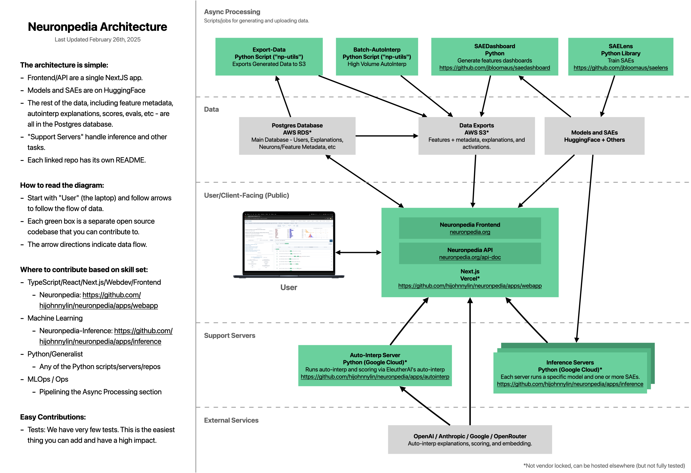

#### neuronpedia 🧠🔍

this is the monorepo for [neuronpedia.org](neuronpedia.org), the open source interpretability platform.

- [quick start (docker compose)](#quick-start-docker-compose)
  - [level 1 - run your own inference server](#level-1---run-your-own-inference-server)
  - [level 2 - run your own database](#level-2---run-your-own-database)
- [===== TODOs Below =====](#-todos-below-)
  - [choose your own adventure](#choose-your-own-adventure)
  - [setup: one-click deploy on vercel](#setup-one-click-deploy-on-vercel)
  - [setup: docker - all services](#setup-docker---all-services)
    - [configuring inference servers](#configuring-inference-servers)
  - [setup: local webapp](#setup-local-webapp)
    - [level 1 - local frontend/api + remote db/support](#level-1---local-frontendapi--remote-dbsupport)
    - [level 2 - configure your own database](#level-2---configure-your-own-database)
  - [addendum: import data from neuronpedia](#addendum-import-data-from-neuronpedia)
  - [addendum: enable search explanations functionality](#addendum-enable-search-explanations-functionality)
- [architecture / services](#architecture--services)
  - [requirements](#requirements)
  - [services](#services)
    - [openapi schema](#openapi-schema)
- [contributing / development](#contributing--development)
  - [using ai](#using-ai)
  - [TODOs](#todos)

# quick start (docker compose)

objective: set up the webapp (frontend + api) locally, connecting to a remote demo database and inference servers. then, customize [each service](#services).

1. install [docker desktop](https://docs.docker.com/desktop/)
2. launch docker desktop and ensure the daemon is running
3. create an environment file by copying the example .env file
   ```
   cp .env.example .env
   ```
4. [optional] for the `search explanations` functionality to work correctly, open `.env` and uncomment `OPENAI_API_KEY` and set your key. save it.
5. build the docker image from the root repository directory
   ```
   docker compose -f docker-compose.webapp.demo.yaml build
   ```
6. bring up the services
   ```
   docker compose -f docker-compose.webapp.demo.yaml up
   ```
7. once everything is up, open [localhost:3000](http://localhost:3000) to load the home page.
8. your local instance is connected to the remote demo database and inference servers, with the following SAEs/sources data available:

| model                          | source/sae                       | comment                               |
| ------------------------------ | -------------------------------- | ------------------------------------- |
| `gpt2-small`                   | `res-jb`, all layers             | a good starter SAE set                |
| `gemma-2-2b` / `gemma-2-2b-it` | `gemmascope-res-16k`, all layers | the SAEs used in the Gemma Scope demo |

## level 1 - run your own inference server

[ TODO ]

## level 2 - run your own database

[ TODO ]

[click here](#setup-import-data-from-neuronpedia) for how to to import data from neuronpedia, because your local database will be empty to start - with no features, activations, or explanations.

# ===== TODOs Below =====

## choose your own adventure

there are many ways to deploy neuronpedia, depending on what you want to have control/customization over. click a method to get started!

| method                                                          | who it's for                                                     | complexity | webapp                   | database                      | inference                    | autointerp          |
| --------------------------------------------------------------- | ---------------------------------------------------------------- | ---------- | ------------------------ | ----------------------------- | ---------------------------- | ------------------- |
| [one-click deploy on vercel](#setup-one-click-deploy-on-vercel) | just curious and/or ultra-impatient                              | easy       | 🟡<br/>semi-customizable | 🟠<br/>shared public database | 🟠<br/>shared public servers | 🔴<br/>none         |
| [docker - all services](#setup-docker---all-services)           | you want all of neuronpedia's features and you're ok with docker | medium-ish | 🟢<br/>customizable      | 🟢<br/>customizable           | 🟢<br/>customizable          | 🟢<br/>customizable |
| [local webapp](#setup-local-webapp)                             | frontend/api development, configurable to add all features       | medium     | 🟢<br/>customizable      | 🟡<br/>configurable           | 🟡<br/>configurable          | 🟡<br/>configurable |
| [local inference](#setup-local-inference)                       | run inference (steering, activations, etc) with your local GPU   | easy       | 🔴<br/>none              | 🔴<br/>none                   | 🟢<br/>customizable          | 🔴<br/>none         |
| [local autointerp](#setup-local-autointerp)                     | run and test autointerp (eleuther) locally                       | easy       | 🔴<br/>none              | 🔴<br/>none                   | 🔴<br/>none                  | 🟢<br/>customizable |

## setup: one-click deploy on vercel

[ TODO ]

## setup: docker - all services

summary: you can use docker compose to set up all services in one command locally. then, you can customize the services.

1. install [docker desktop](https://docs.docker.com/desktop/)
2. launch docker desktop and ensure the daemon is running
3. create an environment file by copying the example .env file
   ```
   cp .env.example .env
   ```
4. for the `search explanations` functionality to work correctly, open `.env` and uncomment `OPENAI_API_KEY` and set your key. save it.
5. build the docker image from the root repository directory (same level as `docker-compose.yaml`)
   ```
   docker compose build
   ```
6. bring up the services
   ```
   docker compose -f docker-compose.yaml up
   ```
7. once everything is up, open [localhost:3000](http://localhost:3000) to load the home page.
8. [click here](#setup-import-data-from-neuronpedia) for how to to import data from neuronpedia, because your local database will be empty to start - with no features, activations, or explanations.

### configuring inference servers

the default docker compose configuration brings up a `gpt2-small` inference server and loads the `res-jb` SAEs. you can change which model and SAEs are loaded by editing the `docker-compose.yaml` file - specifically, the environment variables under `services` -> `inference`.

note that you will only be able to run inference on servers you've configured. for example, even if you have downloaded the data for a gemma scope SAE, you won't be able to run inference on any of the SAEs unless you configure the inference server to load a gemma model and the specific gemma scope SAE.

## setup: local webapp

summary: get the neuronpedia frontend and api working locally, first by using the shared public database/inference servers, with the option to later run your own database/services either locally or remotely. after this, you will be able to do frontend and api development!

### level 1 - local frontend/api + remote db/support

1. install nvm (node version manager).
   ```
   touch ~/.profile && curl -o- https://raw.githubusercontent.com/nvm-sh/nvm/v0.40.1/install.sh | bash
   ```
2. open a NEW terminal to load the correct paths for `nvm`.
3. install node v22.
   ```
   nvm install 22
   ```
4. clone the neuronpedia monorepo and enter the webapp directory.
   ```
   git clone https://github.com/hijohnnylin/neuronpedia.git
   ```
5. install the webapp's dependencies.
   ```
   cd neuronpedia/apps/webapp
   npm install
   ```
6. run the webapp in development mode with the demo database.
   ```
   npm run dev:demo
   ```
7. go to [localhost:3000](http://localhost:3000) and start developing in the `neuronpedia/apps/webapp` directory. your browser will automatically refresh on changes.
8. [click here](#setup-enable-search-explanations) for instructions on how to enable `search explanations`.

### level 2 - configure your own database

summary: set up a postgres 17 database, initialize the schema, and seed it. after this, you will have your own local database, and you can start importing data (features, explanations, activations) from neuronpedia.

**database setup: localhost on macos**

1. download Postgres.app (with postgres 17) from [postgresapp.com/downloads.html](https://postgresapp.com/downloads.html).
2. install it by moving it to your applications folder, then open it.
3. click `initialize`. it should now say `Running`.
4. initialize the schema and seed the database.
   ```
   cd neuronpedia/apps/webapp
   npm run migrate:localhost && npx env-cmd -f .env.localhost prisma db seed
   ```

**running the webapp with a localhost database for development**

1. terminate the webapp if it's running (go to the terminal where it's running, `control+c`).
2. run the webapp in development mode with the local database (note that it's `dev:locahost` instead of `dev:demo`).
   ```
   npm run dev:localhost
   ```
3. go to [localhost:3000](http://localhost:3000) and start developing in the `neuronpedia/apps/webapp` directory. your browser will automatically refresh on changes.

**running the webapp in localhost in production mode**
sometimes you'll want to make a production build and run it locally. this is much faster and doesn't have unnecessary reloads, but it has no debugging capability.

1. build the webapp.

```
npm run build:localhost
```

2. run the webapp.

```
npm run start:localhost
```

**importing data into your localhost database**

[click here](#setup-import-data-from-neuronpedia) for how to import data from neuronpedia, because your local database will be empty to start - with no features, activations, or explanations.

## addendum: import data from neuronpedia

if you set up your own database, it will start out empty - no features, explanations, activations, etc. to load this data, there's a built-in `admin panel` where you can download this data for SAEs (or "sources") of your choosing.

**WARNING: the admin panel does not currently support resuming imports. if an import is interrupted, you must manually click `re-sync`. the admin panel currently does not check if your download is complete or missing parts - once you click "download" and refresh the page, it will assume it was complete. it is up to you to check if the data is complete, and if not, to click `re-sync`.**

**RECOMMENDATION: downloading just one source initially, instead of a `download all` which can be massive and take a long time.**

the instructions below demonstrate how to download the `gpt2-small`@`10-res-jb` SAE data. after it's complete, you'll be able to browse, steer, etc.

1. importing data only works in localhost mode. you cannot import data to the public demo database, because that is read-only. ensure you have [configured your own localhost database](#level-2---configure-your-own-database), or you had docker do it for you.
2. run the production build of the app. for docker, it's `docker compose -f docker-compose.yaml up` from the root directory - otherwise it's `npm run build:localhost && npm run start:localhost` from `neuronpedia/apps/webapp`.
3. navigate to [http://localhost:3000/admin](http://localhost:3000/admin).
4. scroll down to `gpt2-small`, and expand `res-jb` with the `▶`.
5. click `Download` next to `10-res-jb`.
6. wait patiently! depending on your connection/cpu speed it can take up to 30 minutes or an hour.
7. once it's done, click `Browse` or use the navbar to try it out: `Jump To`/`Search`/`Steer`.
8. repeat for other SAE/source data you wish to download.

## addendum: enable search explanations functionality

in the webapp, the `search explanations` feature requires you to set an `OPENAI_API_KEY`. otherwise you will get no search results.

**why an openai api key is needed**
the `search explanations` functionality searches for features by semantic similarity. if you search `cat`, it will also return `feline`, `tabby`, `animal`, etc. to do this, it needs to calculate the embedding for your input `cat`. we use openai's embedding api to calculate the embeddings.

**how to set your openai api key in the webapp**

1. get your openai api key from [platform.openai.com](https://platform.openai.com).
2. ensure that the project associated with the api key has access to the `text-embedding-3-large` embedding model: ("settings", "project->limits" on the left hand side).
3. create or open the `neuronpedia/apps/webapp/.env` file, and add this line to it and save it:

```
OPENAI_API_KEY=[your openai api key here]
```

4. terminate the webapp if it's running (`command+c`), and start it again.

# architecture / services

here's a diagram of how the services/scripts connect in neuronpedia.



## requirements

you can run neuronpedia on any cloud and on any modern OS. neuronpedia is designed to avoid vendor lock-in. these instructions were written for and tested on macos 15 (sequoia), so you may need to repurpose commands for windows/ubuntu/etc. at least 16GB ram is recommended.

## services

each service can be run independently, with the exception of webapp which relies on a database.

| name       | description                                                                                                                                           | powered by                                       |
| ---------- | ----------------------------------------------------------------------------------------------------------------------------------------------------- | ------------------------------------------------ |
| webapp     | serves the neuronpedia.org frontend and [the api](neuronpedia.org/api-doc)                                                                            | [next.js](https://nextjs.org) / react / tailwind |
| database   | stores features, activations, explanations, users, lists, etc                                                                                         | postgres                                         |
| inference  | [support] steering, activation testing, search via inference, topk, etc. a separate instance is required for each model you want to run inference on. | python / torch                                   |
| autointerp | [support] auto-interped explanations and scoring                                                                                                      | python                                           |

### openapi schema

for services to communicate with each other in a typed and consistent way, we use openapi schemas. there are some exceptions - for example, streaming is not officall supported by the openapi spec. however, even in that case, we still try our best to define a schema and use it.
openapi schemas are located under `/schemas`. we use openapi generators to generate clients in both typescript and python.

# contributing / development

## using ai

## TODOs

[ TODO ]
